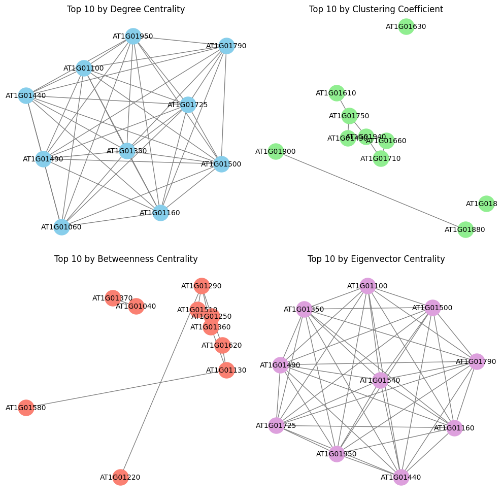

# RNAseq Co-Expression Network Analysis

**Hub Gene Analysis**

This repository demonstrates how to build a co-expression network using RNA-seq data from [Dash et.al 2023](https://doi.org/10.1093/plphys/kiad465). The code loads a read-count table, filters it based on defined control and mutant groups, and then constructs both a combined network and separate control/mutant networks. Various network statistics (degree, clustering, betweenness centrality, and eigenvector centrality) are computed to identify hub genes and compare top genes across metrics.

---

## Table of Contents
1. [Overview](#overview)  
2. [Steps in the Analysis](#steps-in-the-analysis)  
3. [Usage](#usage)  
4. [Dependencies](#dependencies)  
5. [Contributing](#contributing)  
6. [License](#license)  

---

## Overview

The script:
1. Loads RNA-seq read-count data.  
2. Splits samples into control and mutant groups.  
3. Computes Spearman correlation matrices to build co-expression networks.  
4. Identifies key network properties and potential hub genes.  
5. Compares networks between control and mutant conditions.  

---

## Steps in the Analysis

1. **Import Libraries**  
   Imports Python libraries for data manipulation (`pandas`, `numpy`), computing correlations (`scipy.stats`), building and analyzing networks (`networkx`), and visualization (`matplotlib`, `seaborn`).

2. **Define Sample Info (Control vs. Mutant)**  
   - A dictionary contains sample names mapped to their conditions.  
   - This dictionary is converted to a DataFrame (`sample_info`).  
   - The script identifies which samples are control vs. mutant.

3. **Load Read-Count Table, Filter by Sample**  
   - Reads a CSV of raw read-counts for each gene.  
   - Removes genes with zero sum across all samples.  
   - Subsets the table to only keep columns for the required control and mutant samples.

4. **(Optional) Subset Genes for Testing**  
   - For demonstration, the code only keeps the first 100 genes from the dataset.  
   - Adjust or remove for a real-world scenario.

5. **Build a Combined Network (Control + Mutant)**  
   - Computes a Spearman correlation matrix on the transposed read-count table.  
   - Creates an undirected graph (genes as nodes) where edges connect gene pairs with |correlation| ≥ 0.7 by default.

6. **Network Statistics and Hub Genes (Combined)**  
   - Calculates:  
     - Degree  
     - Degree centrality  
     - Clustering coefficient  
     - Betweenness centrality  
     - Eigenvector centrality  
   - Identifies top 10 genes under each metric.  
   - Creates and visualizes subgraphs composed of the top 10 genes for each metric.

7. **Build Separate Networks (Control vs. Mutant)**  
   - Splits the data into control-only and mutant-only DataFrames.  
   - Builds two correlation-based networks with the same threshold.  

8. **Visualize Control vs. Mutant Side-by-Side**  
   - Plots each network in a separate subplot for easy comparison of overall structure.

9. **Compare Network Statistics (Control vs. Mutant)**  
   - Prints the top 10 hub genes by degree for each network.  
   - Calculates network density and average degree.  
   - Checks which hub genes are common or unique to each condition.

10. **Edge Weight Distribution Comparison**  
    - Plots histograms of edge weights (correlation values) in both networks.

---

## Usage

1. **Prepare your data:**  
   - Make sure you have `read_counts_table.csv` with gene names or IDs in one column (titled `gname`) and read counts for each sample in subsequent columns.

2. **Adjust sample information:**  
   - Update the `sample_info_dict` to match your own sample labels and conditions.

3. **Run the script:**  
   - If using a Jupyter Notebook, just run the cells.  
   - Otherwise, run from the command line (Python environment).

4. **Interpret results:**  
   - The script highlights top hub genes and displays network metrics.  
   - Use these metrics to explore potential biomarkers or key regulators.

---

## Dependencies

- Python 3  
- pandas  
- numpy  
- scipy  
- statsmodels (optional in some setups)  
- networkx  
- matplotlib  
- seaborn  

Install any missing packages with:
pip install pandas numpy scipy statsmodels networkx matplotlib seaborn

---

## Contributing

Pull requests and suggestions for improvements are welcome. If you find a bug or have a question, please open an issue.

---

## License

This project is open-source (MIT License). See the [LICENSE](LICENSE) file for details.

**Happy exploring RNA-seq co-expression networks!**
